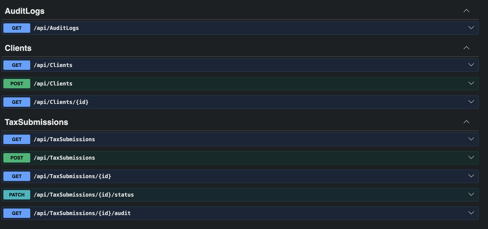
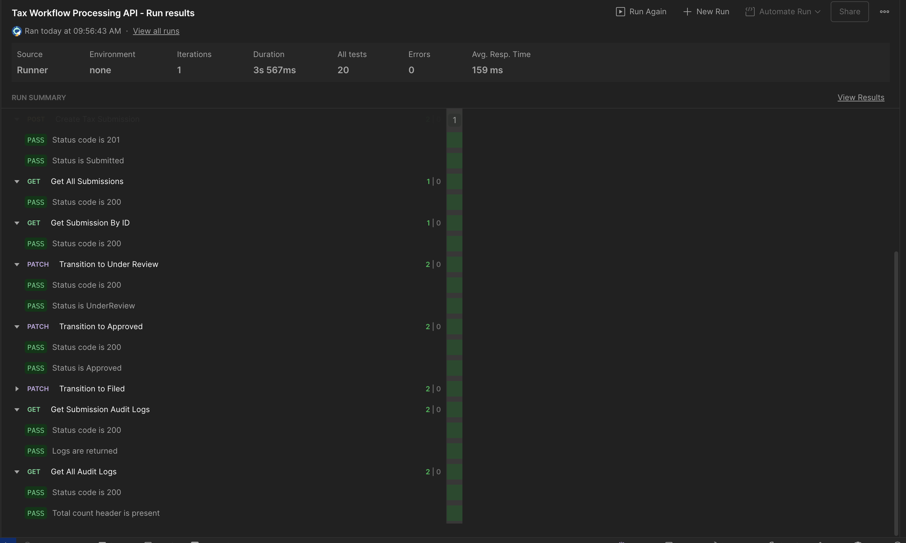
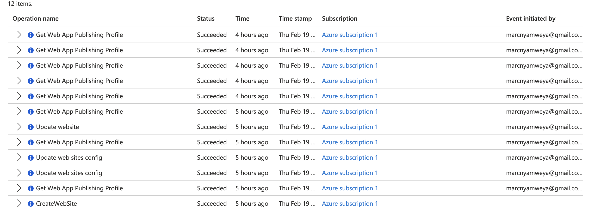

# Tax Workflow Processing API


A backend system simulating an enterprise-grade tax processing workflow. Supports client management, automated tax calculations using real-world IRS 2024 brackets, a state-machine driven workflow, and full audit logging — all exposed via documented REST endpoints.

---

## Table of Contents

- [Architecture](#architecture)
- [Technology Stack](#technology-stack)
- [Local Development Setup](#local-development-setup)
- [Azure Deployment](#azure-deployment)
- [CI/CD with GitHub Actions](#cicd-with-github-actions)
- [API Reference](#api-reference)
- [Tax Calculation Logic](#tax-calculation-logic)
- [Workflow State Machine](#workflow-state-machine)
- [Audit Logging](#audit-logging)
- [Testing with Postman](#testing-with-postman)

---

## Architecture

```
┌─────────────────────────────────────────────────────────────────────┐
│                         Client (Postman / UI)                       │
└──────────────────────────────┬──────────────────────────────────────┘
                               │ HTTPS
                               ▼
┌─────────────────────────────────────────────────────────────────────┐
│                     Azure App Service (Linux B1)                    │
│                                                                     │
│  ┌──────────────────────────────────────────────────────────────┐   │
│  │                    ASP.NET Core Pipeline                     │   │
│  │                                                              │   │
│  │  GlobalExceptionMiddleware  ──►  Catches & logs all errors   │   │
│  │           │                                                  │   │
│  │           ▼                                                  │   │
│  │  ┌─────────────────────────────────────────────────────┐    │   │
│  │  │                   Controllers                       │    │   │
│  │  │  ClientsController  │  TaxSubmissionsController     │    │   │
│  │  │                     │  AuditLogsController          │    │   │
│  │  └──────────┬──────────┴──────────────┬────────────────┘    │   │
│  │             │                         │                      │   │
│  │             ▼                         ▼                      │   │
│  │  ┌──────────────────┐   ┌─────────────────────────────┐     │   │
│  │  │SubmissionValidator│  │         Services             │    │   │
│  │  │  (Business Rules) │  │  TaxCalculationService       │    │   │
│  │  └──────────────────┘  │  AuditService                 │    │   │
│  │                        │  SubmissionWorkflow            │    │   │
│  │                        └──────────────┬────────────────┘    │   │
│  │                                       │                      │   │
│  │                                       ▼                      │   │
│  │                           ┌───────────────────┐             │   │
│  │                           │   AppDbContext     │             │   │
│  │                           │  (EF Core + LINQ)  │             │   │
│  │                           └─────────┬─────────┘             │   │
│  └─────────────────────────────────────┼──────────────────────┘    │
└────────────────────────────────────────┼────────────────────────────┘
                                         │ TCP 1433
                                         ▼
                     ┌───────────────────────────────────┐
                     │   Azure SQL Database (S0 tier)    │
                     │                                   │
                     │   Tables:                         │
                     │   ├── Clients                     │
                     │   ├── TaxSubmissions              │
                     │   └── AuditLogs                   │
                     └───────────────────────────────────┘
```

---

## 📸 Screenshots

### Swagger UI

Interactive API documentation generated via OpenAPI/Swagger.  
All endpoints are testable directly from the browser.



---

### Postman – End-to-End Lifecycle Execution

Full submission lifecycle tested using a Postman collection.  
Includes automated assertions for status transitions and audit logging.



---

### Azure Deployment – App Service Activity

Application deployed to Azure App Service (Linux B1) with Azure SQL backend.  
CI/CD integration via GitHub Actions.



### Folder Structure

```
TaxApi/
├── .github/
│   └── workflows/
│       └── deploy.yml          # GitHub Actions CI/CD
├── Controllers/
│   ├── ClientsController.cs
│   ├── TaxSubmissionsController.cs
│   └── AuditLogsController.cs
├── Data/
│   └── AppDbContext.cs         # EF Core DbContext + Fluent API config
├── DTOs/                       # Request/Response contracts (no model leakage)
│   ├── ClientDtos.cs
│   ├── TaxSubmissionDtos.cs
│   └── AuditLogDtos.cs
├── Infrastructure/
│   ├── deploy.sh               # Provisions all Azure resources
│   ├── deploy-app.sh           # Builds and deploys the app
│   └── teardown.sh             # Removes all Azure resources
├── Middleware/
│   └── GlobalExceptionMiddleware.cs
├── Models/
│   ├── Client.cs
│   ├── TaxSubmission.cs
│   └── AuditLog.cs
├── Services/
│   ├── TaxCalculationService.cs
│   ├── AuditService.cs
│   └── SubmissionWorkflow.cs
├── Validation/
│   └── SubmissionValidator.cs
└── Program.cs
```

---

## Technology Stack

| Layer | Technology |
|---|---|
| Language | C# 13 |
| Framework | .NET 10 Web API |
| ORM | Entity Framework Core 9 |
| Database (local) | SQL Server 2022 via Docker |
| Database (cloud) | Azure SQL S0 |
| Hosting | Azure App Service (Linux B1) |
| Documentation | Swagger / OpenAPI |
| CI/CD | GitHub Actions |
| Testing | Postman |

---

## Local Development Setup

### Prerequisites

- [.NET 10 SDK](https://dotnet.microsoft.com/download)
- [Docker Desktop](https://www.docker.com/products/docker-desktop)
- [Azure CLI](https://learn.microsoft.com/en-us/cli/azure/install-azure-cli-macos) (for deployment only)

### 1. Start SQL Server via Docker

```bash
docker run \
  -e "ACCEPT_EULA=Y" \
  -e "MSSQL_SA_PASSWORD=YourStrong@Password" \
  -p 1433:1433 \
  --name sql_server_container \
  --restart unless-stopped \
  -d \
  mcr.microsoft.com/mssql/server:2022-latest
```

> **Apple Silicon (M1/M2/M3/M4):** Docker Desktop automatically runs this x86_64 image via Rosetta 2. No extra configuration needed.

### 2. Add Development Connection String

Create `appsettings.Development.json` in the project root (this file is git-ignored):

```json
{
  "ConnectionStrings": {
    "DefaultConnection": "Server=localhost,1433;Database=TaxDb;User Id=sa;Password=YourStrong@Password;TrustServerCertificate=True"
  }
}
```

### 3. Apply Migrations and Run

```bash
# Install EF CLI tools (once globally)
dotnet tool install --global dotnet-ef

# Create and apply the schema migration
dotnet ef migrations add InitialCreate
dotnet ef database update

# Run the API
dotnet run
```

Swagger UI is available at `http://localhost:5166`.

> Migrations also auto-apply on startup — if you skip `dotnet ef database update`, the app will create the schema automatically on first run.

---

## Azure Deployment

All scripts live in `Infrastructure/`. Run them from inside that folder.

### Prerequisites — Install Azure CLI on Mac

```bash
brew update && brew install azure-cli
```

Verify the installation:

```bash
az --version
```

### Step 1: Log in to Azure

```bash
az login
```

A browser window opens. Sign in with your Azure account. When complete, your terminal prints your subscription details.

### Step 2: Provision Azure Resources

```bash
cd Infrastructure
chmod +x deploy.sh
./deploy.sh
```

You will be prompted for a SQL admin password (must contain uppercase, lowercase, a digit, and a special character). The script then creates:

| Resource | Name | Approx. Monthly Cost |
|---|---|---|
| Resource Group | `tax-api-rg` | Free |
| Azure SQL Server | `tax-api-sql-server` | — |
| Azure SQL Database | `TaxDb` (S0 tier) | ~$15 |
| App Service Plan | `tax-api-plan` (B1 Linux) | ~$13 |
| Web App | `tax-workflow-api` | Included in plan |

> **Total: ~$28/month.** Delete the resource group when not in use to stop all charges.

### Step 3: Deploy the Application

```bash
chmod +x deploy-app.sh
./deploy-app.sh
```

Builds a Release publish, packages it as a zip, and deploys it to Azure. Your API will be live at:

```
https://tax-workflow-api.azurewebsites.net
```

Swagger UI loads at the root of that URL.

### Step 4: Tail Live Logs (optional)

```bash
az webapp log tail \
  --name tax-workflow-api \
  --resource-group tax-api-rg
```

### Teardown — Stop All Charges

```bash
chmod +x teardown.sh
./teardown.sh
```

Permanently deletes every resource in `tax-api-rg`. You must type the resource group name to confirm.

---

## CI/CD with GitHub Actions

The `.github/workflows/deploy.yml` workflow builds and deploys automatically on every push to `main`.

### One-Time Setup

**1. Get your App Service publish profile:**

```bash
az webapp deployment list-publishing-profiles \
  --name tax-workflow-api \
  --resource-group tax-api-rg \
  --xml
```

**2. Add it as a GitHub secret:**

Go to your repo on GitHub → Settings → Secrets and variables → Actions → New repository secret.

| Field | Value |
|---|---|
| Name | `AZURE_PUBLISH_PROFILE` |
| Value | The full XML output from the command above |

**3. Push to `main`** — the workflow triggers automatically.

### What the Workflow Does

On every push or pull request to `main`: restores, builds, and publishes the app. Deployment to Azure only happens on a direct push to `main` — pull requests run the build step only, so errors are caught before merging.

---

## API Reference

All endpoints return `application/json`. Enum values are serialized as strings (e.g. `"Submitted"` not `1`).

---

### Clients

#### `POST /api/clients` — Register a client

**Request:**
```json
{
  "fullName": "Jane Smith",
  "email": "jane.smith@example.com",
  "taxIdentificationNumber": "123-45-6789",
  "clientType": "Individual"
}
```

`clientType` values: `Individual`, `Corporate`

**Response `201 Created`:**
```json
{
  "id": 1,
  "fullName": "Jane Smith",
  "email": "jane.smith@example.com",
  "taxIdentificationNumber": "123-45-6789",
  "clientType": "Individual",
  "createdAt": "2024-11-01T09:00:00Z"
}
```

**Response `409 Conflict`** (duplicate TIN or email):
```json
{
  "error": "A client with this Tax Identification Number already exists."
}
```

---

#### `GET /api/clients` — List all clients

**Response `200 OK`:** Array of client objects (same shape as above).

---

#### `GET /api/clients/{id}` — Get client by ID

**Response `200 OK`:** Single client object.
**Response `404 Not Found`** if the ID does not exist.

---

### Tax Submissions

#### `POST /api/taxsubmissions` — Submit tax data

`taxType` values: `PersonalIncome`, `Corporate`, `VAT`

**Request — Personal Income:**
```json
{
  "clientId": 1,
  "taxType": "PersonalIncome",
  "taxYear": 2024,
  "grossIncome": 95000.00,
  "deductions": 14600.00
}
```

**Request — Corporate:**
```json
{
  "clientId": 2,
  "taxType": "Corporate",
  "taxYear": 2024,
  "grossIncome": 500000.00,
  "deductions": 120000.00
}
```

**Request — VAT:**
```json
{
  "clientId": 1,
  "taxType": "VAT",
  "taxYear": 2024,
  "grossIncome": 200000.00,
  "deductions": 0,
  "vatableSales": 180000.00,
  "vatRate": 20
}
```

**Response `201 Created`:**
```json
{
  "id": 1,
  "clientId": 1,
  "clientName": "Jane Smith",
  "taxType": "PersonalIncome",
  "taxYear": 2024,
  "grossIncome": 95000.00,
  "deductions": 14600.00,
  "taxableIncome": 80400.00,
  "taxLiability": 13947.00,
  "effectiveRate": 0.1735,
  "vatableSales": null,
  "vatRate": null,
  "status": "Submitted",
  "submittedAt": "2024-11-01T09:15:00Z",
  "reviewedAt": null,
  "resolvedAt": null,
  "reviewerNotes": null
}
```

**Response `400 Bad Request`** (validation failure):
```json
{
  "errors": [
    "Deductions cannot exceed GrossIncome.",
    "TaxYear must be between 2000 and 2024."
  ]
}
```

**Response `404 Not Found`** if the `clientId` does not exist.

---

#### `GET /api/taxsubmissions` — List submissions

Optional query filters: `?clientId=1`, `?status=UnderReview`

**Response `200 OK`:** Array of submission objects.

---

#### `PATCH /api/taxsubmissions/{id}/status` — Advance workflow

**Request:**
```json
{
  "newStatus": "UnderReview",
  "performedBy": "reviewer-001",
  "reviewerNotes": null
}
```

`newStatus` values: `UnderReview`, `Approved`, `Rejected`, `Filed`

**Response `200 OK`:** Updated submission object with new status.

**Response `400 Bad Request`** (invalid transition):
```json
{
  "error": "Cannot transition from Submitted to Approved.",
  "allowed": ["UnderReview"]
}
```

---

#### `GET /api/taxsubmissions/{id}/audit` — Submission audit trail

**Response `200 OK`:**
```json
[
  {
    "id": 4,
    "taxSubmissionId": 1,
    "action": "StatusTransitioned",
    "performedBy": "reviewer-001",
    "details": "Submitted → UnderReview. Notes: none",
    "eventType": "StatusChange",
    "timestamp": "2024-11-01T10:30:00Z"
  },
  {
    "id": 3,
    "taxSubmissionId": 1,
    "action": "TaxLiabilityCalculated",
    "performedBy": "System",
    "details": "GrossIncome=95000, Deductions=14600, TaxableIncome=80400, Liability=13947, Rate=17.35%",
    "eventType": "Calculation",
    "timestamp": "2024-11-01T09:15:00Z"
  },
  {
    "id": 2,
    "taxSubmissionId": 1,
    "action": "TaxSubmissionCreated",
    "performedBy": "1",
    "details": "Type=PersonalIncome, Year=2024, Liability=13947.00",
    "eventType": "Submission",
    "timestamp": "2024-11-01T09:15:00Z"
  }
]
```

---

### Audit Logs

#### `GET /api/auditlogs` — All audit logs (paginated)

Query parameters: `?eventType=ValidationFailure`, `?page=1&pageSize=50`

`eventType` filter values: `Submission`, `StatusChange`, `ValidationFailure`, `SystemError`, `Calculation`

Response includes `X-Total-Count` header with total record count.

---

## Tax Calculation Logic

### Personal Income Tax — IRS 2024 Federal Brackets (Single Filer)

Uses progressive marginal rates — each rate applies only to income within that bracket range, not the total.

| Taxable Income | Marginal Rate |
|---|---|
| $0 – $11,600 | 10% |
| $11,601 – $47,150 | 12% |
| $47,151 – $100,525 | 22% |
| $100,526 – $191,950 | 24% |
| $191,951 – $243,725 | 32% |
| $243,726 – $609,350 | 35% |
| Over $609,350 | 37% |

**Example** — Taxable income of $80,400 (gross $95,000 minus $14,600 standard deduction):

| Bracket | Income in bracket | Rate | Tax |
|---|---|---|---|
| $0 – $11,600 | $11,600 | 10% | $1,160 |
| $11,601 – $47,150 | $35,550 | 12% | $4,266 |
| $47,151 – $80,400 | $33,250 | 22% | $7,315 |
| **Total** | | | **$12,741** |

Effective rate: $12,741 / $80,400 = **15.85%**

### Corporate Tax

Flat **21%** on taxable income (TCJA 2017 US federal rate). Business rule: corporate deductions cannot exceed 90% of gross income.

### VAT

`VatableSales × (VatRate / 100)`. Defaults to 20% if no rate is provided. If `vatableSales` is omitted, `grossIncome` is used as the tax base.

---

## Workflow State Machine

```
  ┌───────────┐     ┌──────────────┐     ┌──────────┐     ┌────────┐
  │ Submitted │────►│ Under Review │────►│ Approved │────►│ Filed  │
  └───────────┘     └──────────────┘     └──────────┘     └────────┘
                           │
                           ▼
                      ┌──────────┐
                      │ Rejected │  (terminal)
                      └──────────┘
```

| From | Allowed transitions |
|---|---|
| `Submitted` | `UnderReview` |
| `UnderReview` | `Approved`, `Rejected` |
| `Approved` | `Filed` |
| `Rejected` | None — terminal state |
| `Filed` | None — terminal state |

Attempting an illegal transition returns `400 Bad Request` with the allowed next states, and the attempt is recorded in the audit log as a `ValidationFailure`.

---

## Audit Logging

Every significant event is recorded with a UTC timestamp, the actor who triggered it, and a structured detail string.

| Event Type | Triggered When |
|---|---|
| `Submission` | Client registered or submission created |
| `Calculation` | Tax liability computed (full income breakdown included) |
| `StatusChange` | Workflow transition successfully applied |
| `ValidationFailure` | Request fails validation or illegal transition attempted |
| `SystemError` | Unhandled exception caught by `GlobalExceptionMiddleware` |

---

## Testing with Postman

Import `TaxApi_Postman_Collection.json` into Postman. The collection includes automated test assertions and uses collection variables to chain requests — the `clientId` from "Register Client" is automatically used in "Create Tax Submission", and `submissionId` flows through all the status transitions.

Run the requests in order to walk a full submission lifecycle:

1. **Register Client** — stores `clientId` in collection variables
2. **Create Tax Submission** — stores `submissionId` automatically
3. **Transition to Under Review** — asserts status is `UnderReview`
4. **Transition to Approved** — asserts status is `Approved`
5. **Transition to Filed** — asserts status is `Filed`
6. **Get Submission Audit Logs** — verifies the trail is non-empty
7. **Get All Audit Logs** — verifies `X-Total-Count` header is present
